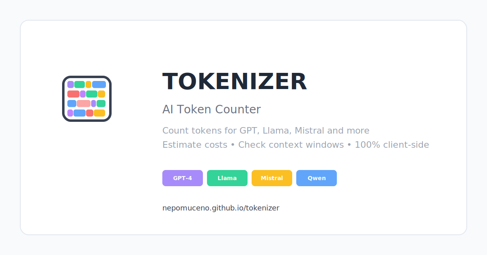

<div align="center">

<br />


# 🔢 Tokenizer — Universal AI Token Counter

<p>
<strong>Fast, accurate, 100% client‑side token counting</strong> for GPT, Llama, Mistral, Qwen, DeepSeek, Phi, and more — all in your browser. No API keys. No backend. Just drop text or files and get counts, context usage, and optional cost estimates instantly.
</p>

[](../../actions)
[](https://nepomuceno.github.io/tokenizer/)
[](LICENSE)
[](https://react.dev)
[](https://bun.sh)
[](#-support)

🔗 <strong>Live Demo:</strong> https://nepomuceno.github.io/tokenizer/

<sub>Deploys automatically on push to <code>main</code>.</sub>

</div>

---

## ✨ Features

| Area | Highlights |
|------|------------|
| Tokenization | Supports GPT (tiktoken), Llama, Mistral, Qwen, DeepSeek, Phi via HuggingFace tokenizers |
| File Ingestion | PDF, Markdown, TXT, DOCX, CSV — fully client‑side extraction |
| Performance | Web Worker offload + lazy WASM loading; handles large files in slices |
| Context Awareness | Shows model context limit + progress bar + over‑limit warning |
| Cost Estimation | Editable per‑1K price; totals by file and aggregate |
| Batch Mode | Drag & drop multiple files with per‑file + total counts |
| Token Preview | Color‑coded token splits for insight & debugging |
| Offline‑Ready | Static build suitable for GitHub Pages; no server dependency |
| UX & Accessibility | Keyboard friendly, ARIA labels, dark mode planned |

---

## 🧠 How It Works

1. User pastes text or drops files.
2. Parsers extract plain text (PDF via `pdfjs-dist`, DOCX via `mammoth`, Markdown via `remark`, raw readers for TXT/CSV).
3. Text is chunked (100–500KiB) and sent to a Web Worker.
4. The worker loads the appropriate tokenizer adapter:
   * `@dqbd/tiktoken` for OpenAI‑style models (WASM)
   * `@huggingface/tokenizers` JSON for Llama/Mistral/Qwen/Phi/DeepSeek
5. The adapter counts tokens and streams progress back.
6. UI displays per‑file stats, model context usage, optional price math, and token preview.

All processing stays in the browser. Nothing is uploaded.

---

## 🗂 Model Registry

Models are defined centrally in `src/modelRegistry.ts` with: key, adapter type, resource (internal tokenizer name or JSON path), context window, and optional pricing reference. This keeps logic declarative and avoids hard‑coding throughout the UI.

---

## 🚀 Quick Start (Local)

Prereqs: Bun (https://bun.sh) installed.

```bash
git clone https://github.com/Nepomuceno/tokenizer.git
cd tokenizer
bun install
bun run dev
```

Build:
```bash
bun run build
```

Preview production build:
```bash
bun run preview
```

Run tests:
```bash
bun run test
```

Lint:
```bash
bun run lint
```

---

## 🧪 Testing Philosophy

Minimal, focused Vitest tests cover tokenizer adapters and integration boundaries. When adding a new model or parser:

1. Add adapter tests (`src/test/*`).
2. Add a small fixture (avoid large binaries in repo).
3. Ensure deterministic count vs. known sample.

---

## 📐 Architecture Overview

```
React UI (components)  --->  Tokenizer Factory  --->  Adapter (tiktoken | hf)  --->  WASM / JSON tokenizer data
        |                        ^                        
        |                        |                        
File Parsers (pdf/markdown/docx/text) ----> Web Worker (tokenize.worker.ts) <---- Model Registry (ctx + meta)
```

Key principles:
* Keep UI pure & declarative.
* Lazy load heavyweight assets (WASM / tokenizer JSON).
* Use transferable data (ArrayBuffer) when scaling.
* Avoid blocking the main thread.

---

## 🛠 Tech Stack

| Category | Tooling |
|----------|---------|
| Framework | React + TypeScript + Vite |
| Runtime / PM | Bun |
| Styling | Tailwind CSS |
| Tokenizers | `@dqbd/tiktoken`, HuggingFace tokenizer JSONs |
| Parsing | `pdfjs-dist`, `remark` + `remark-parse`, `mammoth` |
| Testing | Vitest + Testing Library |
| Deployment | GitHub Pages via Actions |

---

## 🧩 Adding a New Model

1. Drop tokenizer JSON in `public/tokenizers/` (if HF style).
2. Add entry to `modelRegistry.ts` with key + ctx size.
3. (Optional) Add pricing metadata.
4. Write/extend adapter tests.
5. Build & verify counts.

---

## 🤝 Contributing

Contributions welcome! See [CONTRIBUTING.md](CONTRIBUTING.md) for detailed setup, guidelines, and PR checklist.

Please follow conventional commits where practical (e.g., `feat: add qwen tokenizer`).

---

## 🔐 Security

Report vulnerabilities privately via GitHub Security Advisories or the email listed in [SECURITY.md](SECURITY.md). Avoid opening public issues for sensitive disclosures.

---

## ☕️ Support

If this project saves you time, you can buy me a coffee:

https://buymeacoffee.com/gabrielbici

Sharing the repo also helps a ton! 💙

---

## 📜 License

Licensed under the [MIT License](LICENSE).

---

## 🙏 Acknowledgements

Inspired by community token counters and upstream tokenizer libraries. Thanks to:
* `@dqbd/tiktoken`
* HuggingFace `tokenizers`
* Open‑source parser ecosystems (pdfjs, remark, mammoth)

---

## 🗺 Roadmap (High‑Level)

- [ ] Dark mode toggle
- [ ] PWA / offline caching
- [ ] Custom user‑uploaded tokenizer JSON
- [ ] Cost presets per vendor
- [ ] CSV Export of batch results

<sub>Have an idea? Open a discussion or PR!</sub>

---

### Star History

<picture>
  <source media="(prefers-color-scheme: dark)" srcset="https://starchart.cc/Nepomuceno/tokenizer.svg?theme=dark" />
  
</picture>

---

<div align="center">
<strong>Built with ❤️ for the AI developer community.</strong>
</div>

